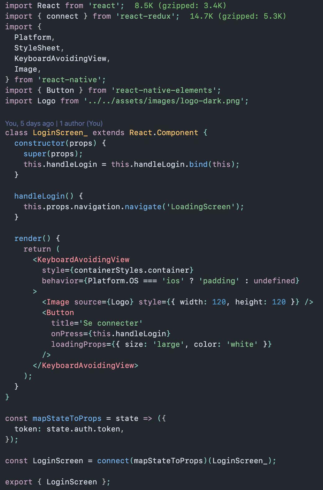

# README

This is a VS Code theme that tries to be faithful to the syntax coloring from React's website code examples.

inspiration came from this StackOverflow [question](https://stackoverflow.com/questions/48365554/vscode-theme-of-react-documentation/59564470#59564470), and our own needs over at [Moon](www.moonhealth.ai) for a readable and nice-looking theme.

Below is an example of React Native code. It also works great with Vue.js, Python (and probably other languages too).



## Development

### Publishing

```zsh
vsce package
vsce publish
```
